## SonarQube란?

SonarQube는 코드 품질과 보안성을 분석하는 정적 분석 도구로, 개발 프로세스에서 코드의 신뢰성과 안전성을 높이는 데 기여한다. 다양한 프로그래밍 언어를 지원하며, CI/CD 파이프라인에 통합해 지속적인 코드 검사를 가능하게 한다. `CWE, OWASP, SANS Top 25` 등 보안 취약점 기준을 기반으로 보안 이슈를 탐지한다.

## 주요 기능

| 구분 | 설명 |
| -- | -- |
| 지원 언어 | Java, C#, C, C++, JavaScript, TypeScript, Python, PHP, Ruby, Swift, Kotlin, Go 등 30여 개 이상 |
| 분석 유형 | 코드 버그, 보안 취약점, 코드 스멜, 복잡도, 테스트 커버리지, 중복 코드 |
| 보안 분석 | CWE 기반 취약점 탐지, OWASP Top 10 대응 가능, 보안 취약점 심각도 분류 |
| 통합 지원 | Jenkins, GitHub Actions, GitLab CI, Azure DevOps 등 CI/CD 툴 연동 |
| 품질 게이트(Quality Gate) | 사전에 설정한 코드 품질 기준 통과 여부 판단, 자동 빌드 실패 처리 가능 |
| 플러그인 확장성 |	언어별, 기능별 플러그인 제공 및 커스텀 플러그인 개발 가능 |
| 대시보드 및 리포팅 | 프로젝트별 통합 대시보드 제공, 상세 이슈 리포트, 이력 관리 |
| 사용자 관리 | 역할 기반 접근 제어, 팀 단위 권한 분리 |

## Architecture

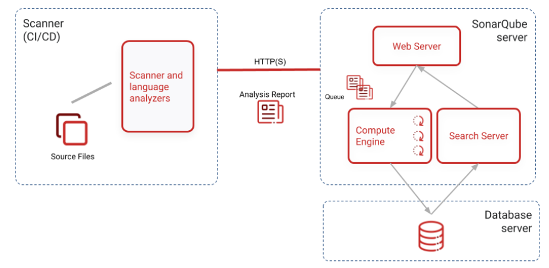

1.SonarQube Server
3가지의 메인 프로세스를 구동시킨다.

- Web Server: 사용자들에게 분석 결과를 보여주고, SonarQube 설정 페이지를 제공
- Search Server: Elasticsearch 서버를 사용하며, 사용자에게 검색 기능을 제공
- Compute Engine: 정적 분석 결과를 생성하고 이를 SonarQube Database에 저장

2.Databse Server
SonarQube의 기본 설정들(보안, Plugin 정보 등)과 프로젝트 분석 스냅샷들을 저장한다.

3. Scanner
프로젝트 정적 분석을 수행한다. CI 파이프라인과 통합되어 소스코드를 분석한다.

## 소스에서 검사

1. SonarQube 서버 구동

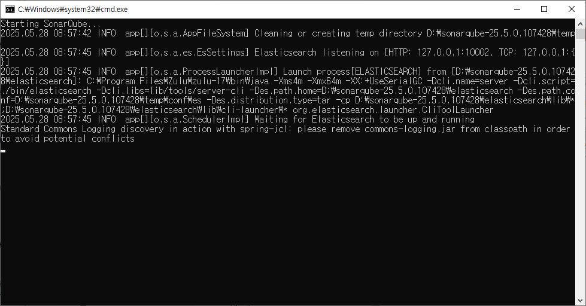

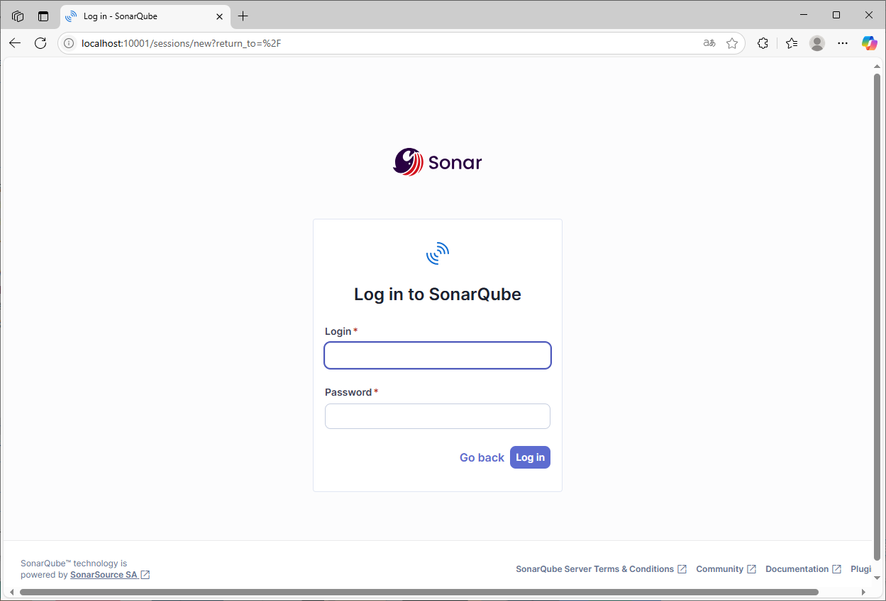

2. Project 생성 및 토큰 생성

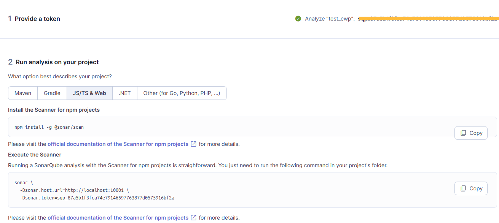

3. 소스에서 검사

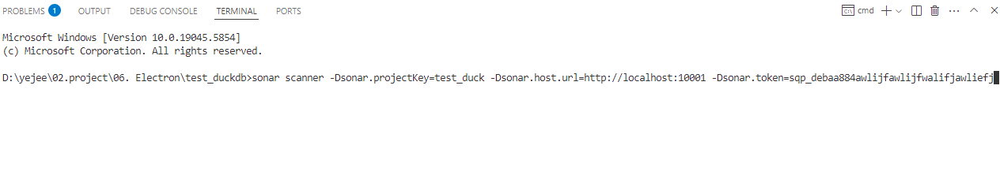

4. 결과

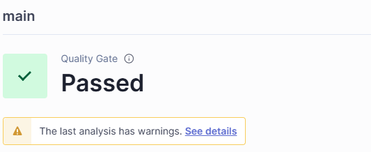

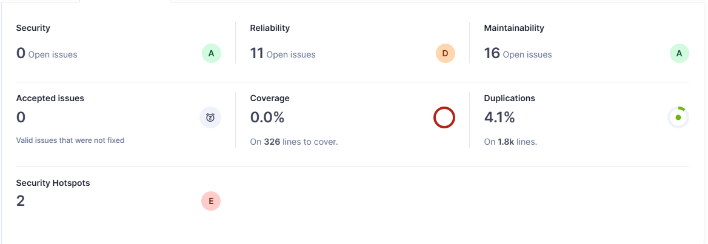

| 규칙 유형 | 설명 |
| -- | -- |
| Reliability |	코드 안정성과 관련된 버그입니다. 예기치 않은 동작이나 충돌을 일으킬 수 있는 버그를 의미합니다. |
| Maintainability |	유지보수에 어려움을 줄 수 있는 ‘낮은 코드 품질’의 지표입니다. 복잡하거나 중복된 코드, 긴 메소드, 일관성 없는 네이밍 규칙 등이 포함될 수 있습니다. |
| Security | 코드에서 발견된 최근 취약점을 강조합니다. 공격자가 이용할 수 있는 잠재적인 취약점이나 안전하지 않은 데이터 처리 등을 의미합니다. |
| Security Hotspots | 보안 핫스팟은 추가적인 관심과 보안 검토가 필요한 코드 영역을 나타냅니다. 취약점이나 보안 위험이 존재할 수 있는 부분입니다. |
| Coverage | 커버리지는 자동화된 테스트가 실행한 코드의 비율을 의미합니다. 테스트 중 실행된 코드의 백분율을 측정합니다. |
| Duplications | 중복 코드는 코드베이스 내에서 중복된 코드 블록을 나타냅니다. 중복을 식별하고 줄이는 것은 코드의 유지보수성을 향상시키고 잠재적인 문제를 줄일 수 있습니다. |

## Jenkins와 Sonarqube 연동

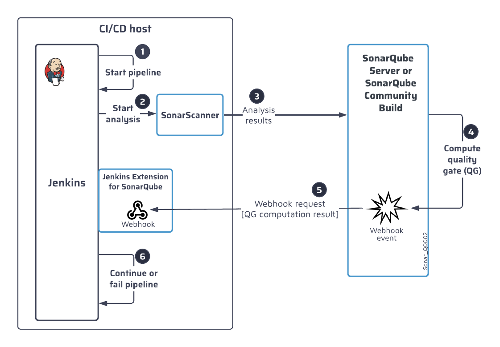

1. SonarQube에서 User Token 발급

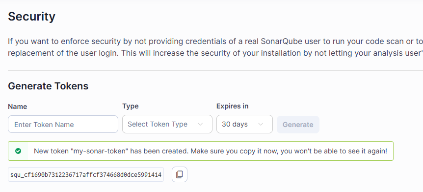

2. jenkins에서 플러그인 설치

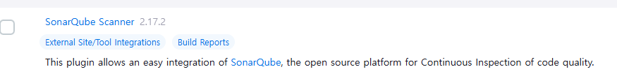

3. Credential 추가

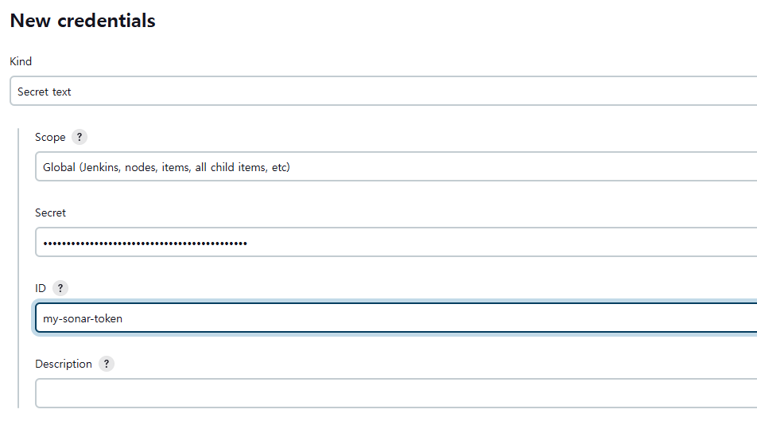

4. System 설정

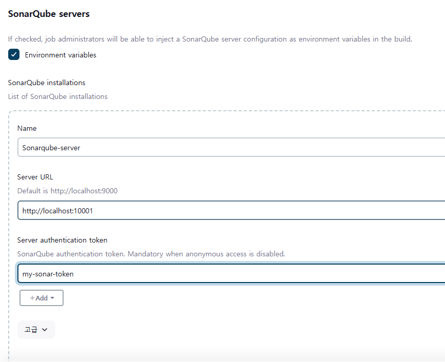