# Process

## Electron의 Process Model

프레임워크를 만드는 Chromium의 다중 프로세스 아키텍처를 상속합니다. 단일 프로세스를 사용함에 따라 하나의 웹사이트가 충돌하거나 중단되면 전체 브라우저에 영향을 미칠 수 있습니다. 이 문제를 해결하기 위해 각 탭이 자체 프로레스에서 렌더링 되고 단일 브라우저 프로세스가 각 탭 프로세스는 물론 애플리케이션 수명주기 전체를 제어합니다.

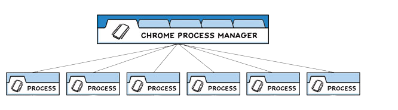

Electron은 이와 매우 유사하게 구조화되어있습니다. 앱 개발자는 두 가지 유형의 Main 프로세스, Renderer 프로세스를 제어합니다.

## Main Process

각 Electron 앱에는 애플리케이션의 진입점 역할을 하는 단일 기본 프로세스가 있습니다. 이 기본 프로세스는 Node.js 환경에서 실행됩니다.

#### 1. 창(BrowserWindow) 관리

Main Process의 주요 목적은 BrowserWindow 인스턴스를 생성하여 애플리케이션 창을 만들고 관리하는 것입니다.

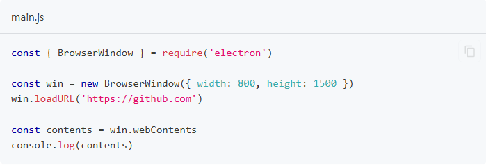

BroswerWindow 클래스의 각 인스턴스는 별도의 Renderer Process에서 웹 페이지를 로드하는 애플리케이션 창을 만듭니다. 창의 webContents 개체를 사용하여 Main Process에서 이 웹 컨텐츠와 상호작용할 수 있습니다. 인스턴스가 소멸되면 해당 렌더러 프로세스도 종료됩니다.

#### 2. Application 생명주기

Main Process는 Electron의 앱 모듈을 통해 애플리케이션의 라이프사이클을 제어합니다. 이 모듈은 사용자 정의 애플리케이션 동작(ex: 프로그래밍 방식으로 애플리케이션 종료, 애플리케이션 도크 수정 또는 정보 패널 표시)을 추가하는데 사용할 수 있는 다양한 이벤트 및 메서드 세트를 제공합니다.

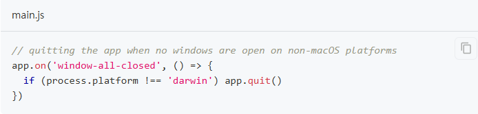

#### 3. Native APIs

Electron의 기능을 웹 콘텐츠용 Chromium Wrapper 이상으로 확장하기 위해 Main Process는 사용자 운영 체제와 상호 작용하는 맞춤형 API도 추가합니다.
메뉴, 대화상자 및 트레이 아이콘과 같은 기본 데스크톱 기능을 제어하는 다양한 모듈을 제공합니다.

## Renderer Process

각 Electron 앱은 열려있는 각 BrowserWindow 그리고 웹에 포함할 때마다 별도의 Renderer Process를 생성합니다. 이름에서 알 수 있듯이 Renderer는 웹 콘텐츠 렌더링을 담당합니다. 예를 들면, 기존에 익숙하게 개발하던 react, vue등의 코드들이 Renderer Process쪽이라고 볼 수 있습니다. Main Process와는 IPC를 통해 통신합니다.  모든 의도와 목적을 위해 Renderer Process에서 실행되는 코드는 웹 표준에 따라 작동해야 합니다.

웹 사양에 대해 최소한 이해해야하는 내용은 아래와 같습니다.
- HTML 파일은 Renderer Process의 진입점입니다.
- UI 스타일은 CSS를 통해 추가됩니다.
- 실행 가능한 JavaScript 코드는 `<script>` 요소를 통해 추가할 수 있습니다.

더불어, 이는 Renderer가 다른 Node.js API에 직접 액세스할 수 없다는 의미입니다. Renderer에 NPM 모듈을 직접 포함하려면 웹에서 사용하는 것과 동일한 번들러 도구(ex: webpack, parcel)를 사용해야 합니다.

## Preload Scripts

Preload Scripts는 Electron 애플리케이션에서 웹 페이지와 Node.js 환경 간의 다리를 놓는 역할을 합니다. 브라우저에서 사용할 수 없는 Node.js API를 웹 페이지에 안전하게 노출시키는 역할을 합니다. 추가로 Preload 스크립트를 사용하면 특정 기능만 웹 페이지에 노출 시킬 수 있습니다. 프리로드 스크립트는 BrowserWindow 생성자의 webPreferences 옵션에서 기본 프로세스에 첨부할 수 있습니다.

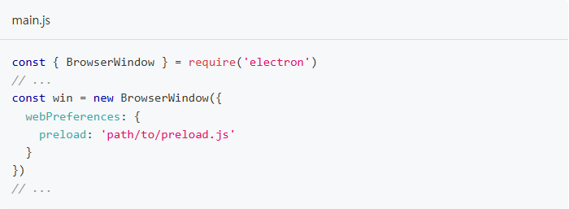

Preload Scripts는 Renderer와 전역 Window 인터페이스를 공유하고 Node.js API에 액세스할 수 있으므로 웹 콘텐츠가 사용할 수 있는 임의의 API를 전역에 노출하여 Renderer를 향상시키는 역학을 합니다.

Preload Scripts는 연결된 Renderer와 전역을 공유하지만 contestIsoloation 기본값으로 인해 Preload Scripts의 변수를 창으로 직접 연결할 수는 없습니다.


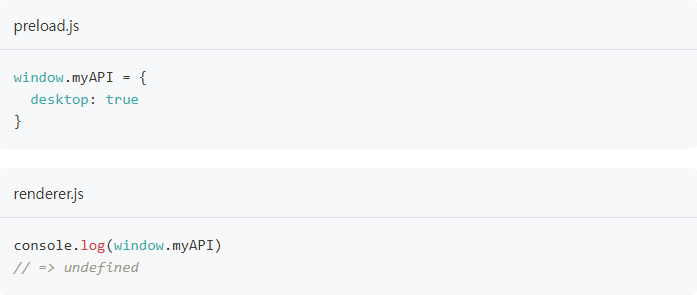

웹 콘텐츠의 코드에 권한 있는 API가 유츌되지 않도록 Preload Scripts를 Reneder의 기본 세계에서 격리하는 ContextIsolation 대신 ContextBridge 모듈을 사용하여 안전하게 접근할 수 있습니다.

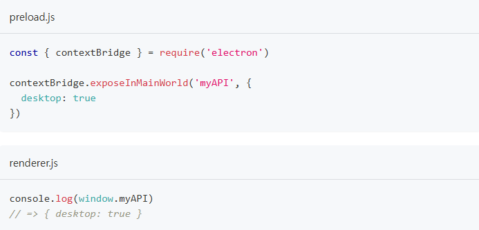


이 기능은 다음 두 가지 주요 목적에 매우 유용합니다.

- ipcRenderer 도우미를 Renderer에 노출하면 IPC(프로세스 간 통신)를 사용하여 Renderer에서 Main Process 작업을 트리거 할 수 있으며 
그 반대도 마찬가지입니다.

- 원격 URL에서 호스팅되는 기존 웹 앱에 대한 Electron Wrapper를 개발하는 경우 웹 클라이언트 측의 데스크톱 전용 로직에 사용할 수 있는 사용자 정의 속성을 Renderer의 전역에 추가할 수 있습니다.

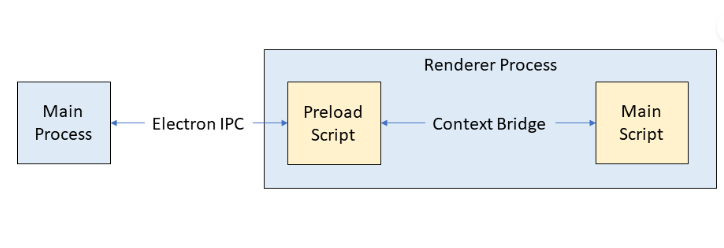

# IPC (Inter-Process Communication)

IPC는 Electron에서 기능이 풍부한 데스크톱 애플리케이션을 구축하는 핵심 부분입니다. Main Process와 Renderer Process는 Electron의 Process Model에서 서로 다른 역할을 가지기 때문에 IPC는 UI에서 기본 API를 호출하거나 기본 메뉴에서 웹 콘텐츠의 변경 사항을 트리거하는 등 많은 일반적인 작업을 수행하는 유일한 방법입니다.

## IPC Channels

Process는 ipcMain 및 ipcRenderer 모듈을 사용하여 개발자가 정의한 Channel을 통해 메시지를 전달하여 통신합니다. 이러한 채널은 임의적(원하는 이름으로 지정 가능) 및 양방향(두 모듈 모두에 동일한 채널 이름 사용 가능)입니다.

- ipcMain: Main Process에서 사용되며, Renderer Process로부터 메시지를 수신하고 응답을 보낼 수 있습니다.
- ipcRenderer: Renderer Process에서 사용되며, Main Process에 메시지를 보내고 응답을 수신할 수 있습니다.

## Pattern 1: Renderer to Main (one-way)

Renderer Process에서 Main Process로 단방향 IPC 메시지를 실행하려면 ipcRenderer.send API를 사용하여 메시지를 보내고 ipcMain.on API에서 수신할 수 있습니다.

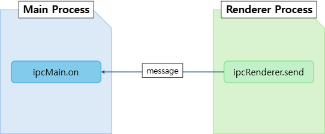

일반적으로 이 패턴을 사용하여 웹 콘텐츠에서 Main Process API를 호출합니다.

#### 1. Listen for events with "ipcMain.on"

Main Process에서 set-title이라는 API를 사용하여 채널에 IPC Listener를 설정합니다.

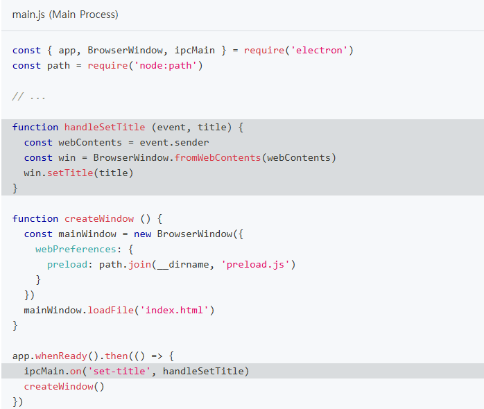

위 콜백에는 두개의 매개변수(handleSetTitle Structure, 문자열)가 있습니다. 메시지가 채널을 통해 올 때마다 이 함수는 메시지를 보낸 곳에 연결된 BrowserWindow 인스턴스를 찾고 그곳에서 API를 사용합니다.

#### 2. Expose via preload

위에서 생성한 Listener에게 메시지를 보내려면 API를 사용할 수 있습니다. 기본적으로 Renderer Process에는 Node.js나 Electron 모듈에 접근할 수 없습니다.
앱 개발자로서 Preload Script를 사용하여 어떤  API를 노출할지 선택해야합니다.

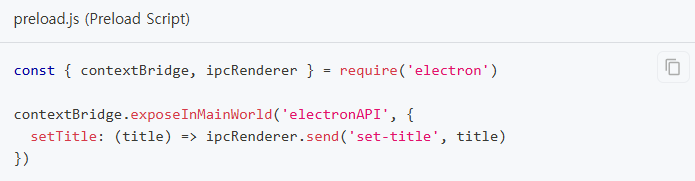

contextBridge 모듈을 사용하여 Renderer Process에 전역 변수를 노출시킬 수 있습니다. 이 시점에 Renderer Process에서 해당 함수를 사용할 수 있게 됩니다.

#### 3. Build the Renderer Process UI

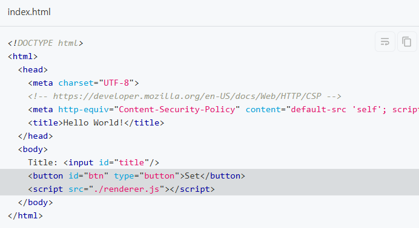

BrowserWindow에 로드된 HTML 파일에 텍스트 입력돠 버튼으로 구성된 기본 UI를 추가합니다. 위 요소를 대화형으로 만들기 위해 Preload Scripts에서 노출된 기능을 활용하는 코드를 추가합니다.

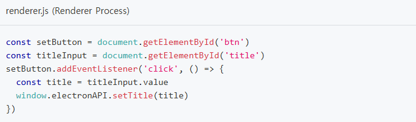

## Pattern 2: Renderer to Main (two-way)

두 Process 간의 양방향 IPC의 일반적인 용도는 Renderer Process 코드에서 Main Process 모듈을 호출하고 결과를 기다리는 것입니다. 이를 위해 ipcRenderer.invoke와 ipcMain.handle을 사용할 수 있습니다.

#### 1. ipcMain.handle로 이벤트 듣기

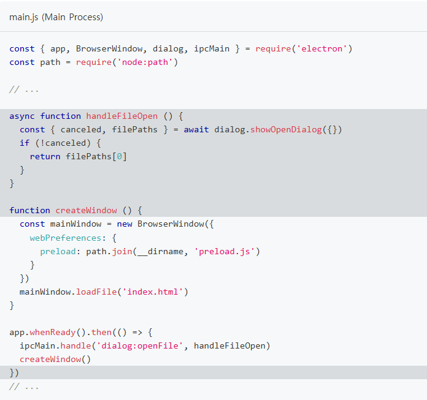

#### 2. Expose via prelaod

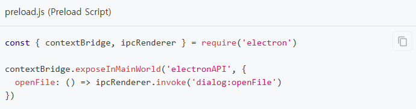

#### 3. Build the renderer process UI

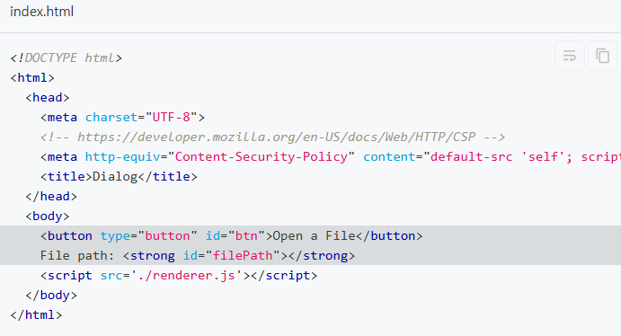

preload API를 트리거하는데 사용되는 버튼을 구성합니다. 

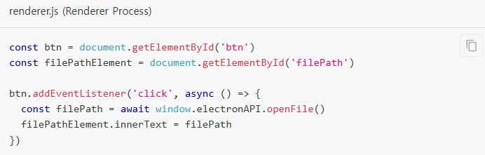

## Pattern 3: Main to renderer

Main Process에서 Renderer Process로 메시지를 보낼 때, 메시지를 받는 Renderer를 지정해야합니다. 메시지는 webContents 인스턴스를 통해 Renderer Process로 전송되어야합니다. webContents 인스턴트에는 ipcRenderer.send와 동일한 방식의 send 메서드가 포함되어 있습니다.

#### 1. webContents 모듈로 메시지 보내기

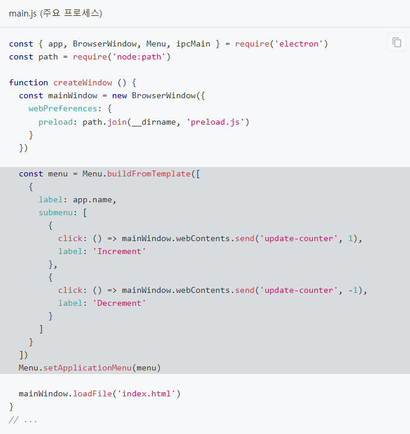

#### 2. Expose via preload

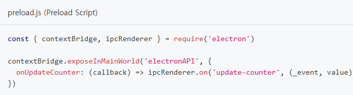

#### 3. Build the renderer process UI

counter를 통해 이벤트를 발생 시킬때마다 업데이트 되는 내용 확인하도록 합니다.

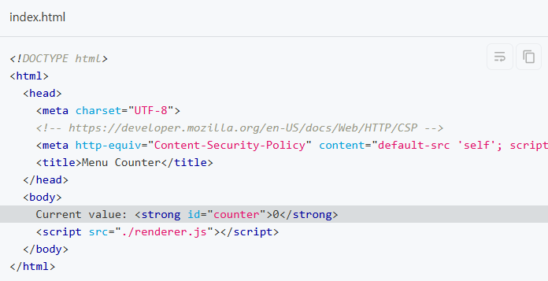

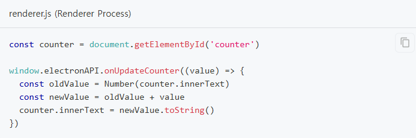

## Pattern 4: Renderer to renderer

Renederer Process 간에 메시지를 직접 보내는 방법은 없습니다.
Main Process를 메시지 브로커로 사용하여 메시지를 Main Process로 보내면 다른 Renderer로 전달합니다.

# Process SandBoxing

Chromium의 주요 보안 기능 중 하나는 샌드박스 내에서 프로세스를 실행할 수 있다는 것입니다.
샌드박스는 대부분의 시스템 리소스에 대한 접근을 제한하여 악성 코드가 유발할 수 있는 피해를 제한합니다. 샌드 박스된 프로세스는 CPU 사이클과 메모리만 자유롭게 사용할 수 있습니다.
Chromium에서는 Main Process를 제외한 대부분의 프로세스에 샌드박싱이 적용됩니다.

## 1. Electron의 샌드박스 동작

대부분 Chromium과 동일한 방식으로 작동하지만 Electron은 Node.js와 인터페이스하기 때문에 고려해야할 몇가지 추가 개념이 있습니다.

#### Renderer Process

Electron의 Renderer Process가 샌드박스 되면 일반 Chrome Renderer가 작동합니다. 샌드박스된 Renderer는 Node.js 환경이 초기화 되지 않습니다.
따라서 샌드박스가 활성화 되면 Renderer Process는 파일 시스템과 상호 작용, 시스템 변경, 하위 프로세스 생성 등의 권한이 있는 작업을 수행할 때, 
IPC를 통해 Main Process에 위임해야만 합니다.

#### Preload scripts
Renderer Process가 Main Process와 통신할 수 있도록 하기 위해, 샌드박스된 Renderer에 연결된 preload scripts는 Node.js API의 일부를 사용할 수 있습니다.

## SandBox 구성

대부분의 앱에서는 샌드박싱이 최선의 선택입니다. 하지만 샌드박스와 호환되지 않는 특정 사례에서는 특정 프로세스에 대해 샌드박스를 비활성화 할 수 있습니다.

* 단일 프로세스에 대한 샌드박스 비활성화

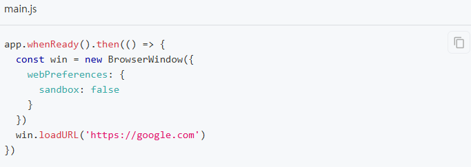

* 전역적으로 샌드박스 활성화

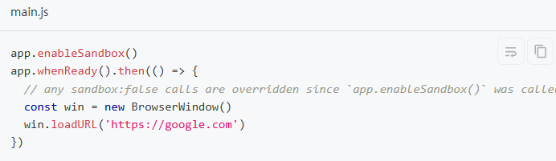

## Vue + Electron 연결

#### 1. vue 프로젝트 생성

```
D:\Electron>vue create electron-vue
```

#### 2. vue 프로젝트에 electron builder 설치
```
D:\Electron\electron-vue>vue add electron-builder
```

#### 3. 앱 실행
```
D:\Electron\electron-vue>npm run electron:serve
```

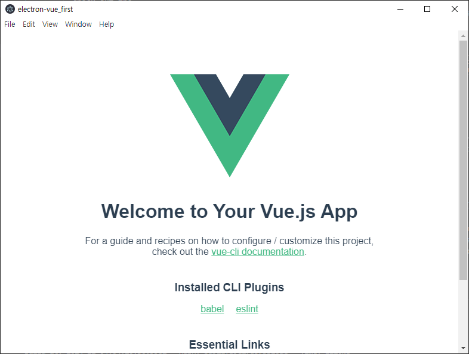

## 외부 프로그램 실행

#### 1. 파일 동작
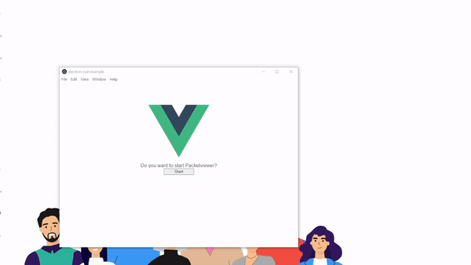

#### 2. 파일 구성

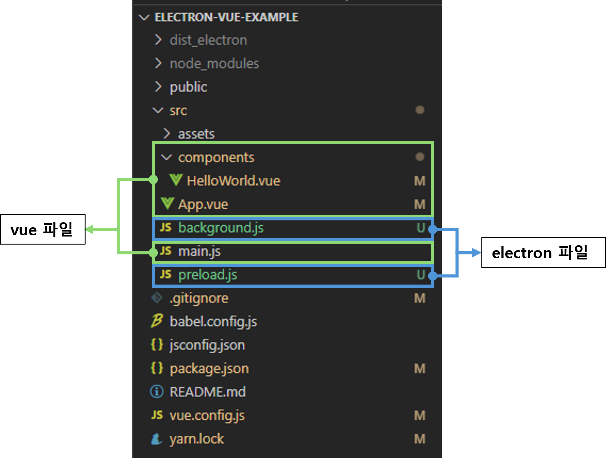

```javascript
-- vue.config.js

const { defineConfig } = require('@vue/cli-service')
module.exports = defineConfig({
  transpileDependencies: true,
  pluginOptions: {
    electronBuilder: {
      nodeIntegration: false,
      contextIsolation: true,
      preload: 'src/preload.js'
    }
  }
})
```

```javascript
-- background.js

import { app, protocol, BrowserWindow, ipcMain } from 'electron'
import { createProtocol } from 'vue-cli-plugin-electron-builder/lib'
import installExtension, { VUEJS3_DEVTOOLS } from 'electron-devtools-installer'
import path from 'path'const 
const { spawn } = require('child_process');

async function createWindow() {  // Create the browser window.  
const win = new BrowserWindow({    
    width: 800,    height: 600,    
    webPreferences: {            // Use pluginOptions.
        nodeIntegration: process.env.ELECTRON_NODE_INTEGRATION,      
        contextIsolation: !process.env.ELECTRON_NODE_INTEGRATION,      
        preload: path.join(__dirname, 'preload.js')    
    }
})

ipcMain.on('control-packetviewer', () => {  
    console.log('control-packetviewer');  
    spawn('C:\\Program Files\\Accuver\\AEGIS-O\\packetviewer\\PacketViewer2.exe',             
            'bf34a149e64874639ae4d43817a55a4e097c31d6']);})
```

```javascript
-- preload.js

import { contextBridge, ipcRenderer } from "electron";

contextBridge.exposeInMainWorld('api', {    
    controlPacketviewer: () => ipcRenderer.send('control-packetviewer')
});
```

```javascript
-- HelloWorld.vue

methods: {
    clickButton() {
      console.log('click');
      window.api.controlPacketviewer();
    }
}
```