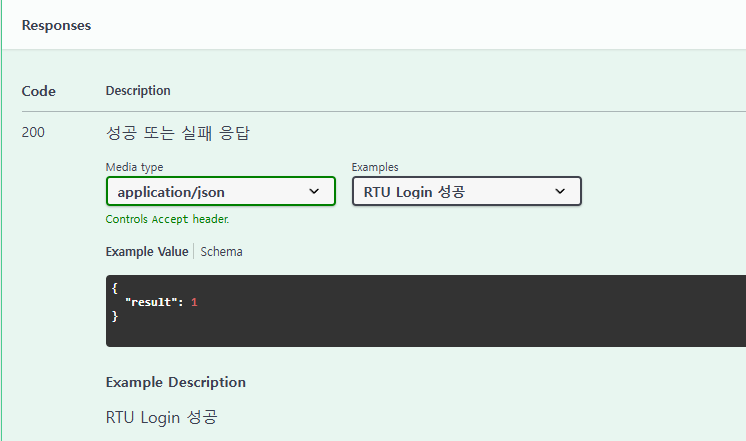

## 개요

- 웹 서비스 명세를 문서화 해주는 오픈 소스 소프트웨어 프레임워크.

- API에 대한 명세(Spec)을 관리하고 REST API를 문서화하는 도구.

- API가 수정되면 문서는 자동으로 갱신된다.

## Application.yml 기본

```
# 기본 옵션
springdoc:
    version: ${project.version}
    api-docs:
        enabled: true # /v3/api-docs endpoint 
    swagger-ui:
        path: /swagger-ui # Swagger-UI의 경로를 /swagger-ui로 설정
        path-to-match: /api/** # 매칭되는 경로의 api들을 문서에 표현.
        disable-swagger-default-url: true # Swagger UI의 기본 설정으로 제공되는 Petstore 예제 URL을 비활성화하는 기능.
        display-request-duration: true # 각 요청에 걸린 시간을 보여주는 기능.
```

```
# 추가 옵션
springdoc:
    paths-to-exclude: /api/mobile-protocol/set-rtu-data # 문서에 포함하지 않을 api
    api-docs:
        path: /v3/api-docs # JSON 형식의 OpenAPI 문서가 /v3/api-docs 경로에서 제공
    swagger-ui:
        enabled: false # 외부에 swagger-ui를 노출시키지 않을때 사용하는 옵션
```

## Swagger 의존성 추가
pom.xml 의존성 추가

```
<dependency>
    <groupId>org.springdoc</groupId>
    <artifactId>springdoc-openapi-ui</artifactId>
    <version>1.8.0</version> 
</dependency>
<dependency>
    <groupId>org.springdoc</groupId>
    <artifactId>springdoc-openapi-starter-webmvc-ui</artifactId>
    <version>2.5.0</version>
</dependency>
```

## SwaggerConfig.java

```
/** 
* Springdoc - Swagger 설정 클래스 
*/
@Configuration
public class SwaggerConfig {
    @Value("${project.name}")
    private String projectName;

    @Value("${springdoc.version}")
    private String springdocVersion;

    @Value("${project.patch-date}")
    private LocalDateTime patchDate;
    
    @Bean    
    public OpenAPI openAPI() {
        return new OpenAPI()
                .components(new Components())
                .info(apiInfo());
    }

    private Info apiInfo() {
        return new Info()
                .title(String.format("%s", projectName))
                .version(String.format("%s", springdocVersion))
                .description("patch date: " + patchDate.format(DateTimeFormatter.ofPattern("yyyy-MM-dd HH:mm:ss")))
                .license(new License().name("Apache 2.0").url("http://springdoc.org"));
    }
}
```

### Info Object

| Field Name | Type | Description |
| -- | -- | -- |
| title | string | 프로젝트 타이틀 |
| description | string | 프로젝트 description |
| termsOfService | string | API 약관 |
| contact | Contact Object | Contact information |
| license | License Object | License information |
| version | string | version 정보 |

## @Tag

API 그룹을 정의, 분류할 때 사용한다.

- name : 태그의 이름

- description : 태그에 대한 설명

```
@Tag(name = "protocol", description = "Mobile 연동 관련 컨트롤러")
public class ProtocolController {
    private static final String AUTH_CHECK_PATH = "auth-check";
    ...
}
```


## @Parameter(hidden=true) or @Operation(hidden = true) or @Hidden

문서에서 제공하지 않을 API 내용을 표현할 때 사용한다.

```
@Hidden
@GetMapping("getMappingTest")
public void test() {
    protocolService.getMethodTest("test");
}
```

## @Operation

특정 Endpoint에 대한 메타데이터를 정의한다. Endpoint에 대한 설명, 요청 방식, 응답코드 등을 설정할 수 있다.

- summary : 간단한 설명 설정

- description : 상세 설명 설정

- method : 요청 방식을 지정할 수 있다.

- tags : 그룹을 지정할 수 있다.

```
@Operation(summary = "특정 ID로 사용자 조회",
        description = "사용자의 ID를 Parameter로 받아서 사용자 정보를 제공한다.",
        method = "GET"
)
@GetMapping("get-user-info")
public void getUserInfo(@Parameter(description = "사용자 ID", required = true) 
                                @RequestParam String userId) {
    protocolService.getUserInfo(userId);
}
```


## @ApiResponses

API의 응답코드와 설명을 설정할 수 있다.

```
@ApiResponses(value = {
        @ApiResponse(responseCode = "200", 
                description = "성공 또는 실패 응답",        
                content = @Content(mediaType = "application/json",
                schema = @Schema(type = "object"),
                examples = {
                        @ExampleObject(name = "성공", value = "{\"result\": 1}"),
                        @ExampleObject(name = "실패", value = "{\"result\": 0, \"errorMsg\" : \"error message\"}")}))
})
@PostMapping(path = UPDATE_RTU_DATA, consumes = MediaType.APPLICATION_JSON_VALUE)
public Map<String, Object> updateRtuData(@RequestBody final RtuModel rtuModel) {
    return protocolService.updateRtuData(rtuModel);
}
```



## @Parameter

사용되는 파라미터에 대한 정보를 정의할 수 있다.

```
@GetMapping("get-user-info")
public void getUserInfo(@Parameter(description = "사용자 ID", required = true) 
                                @RequestParam String userId) {
    protocolService.getUserInfo(userId);
}
```


## Schema

특정 모델 클래스나 필드에 대한 메타데이터를 정의한다. 모델의 속성 설명, 예제 등을 설정할 수 있다.

```
public class RtuModel {
    @Id    
    @JsonAlias({"rtuID", "rtu_id"})
    @Schema(title = "RTU ID", description = "단말 ID", type="String", requiredMode = Schema.RequiredMode.REQUIRED, example = "R0001")
    private String rtuId;

    @Schema(title = "RTU Type", description = "Rtu Type", type="integer", example = "0")
    @JsonAlias({"rtu_type", "rtuType"})
    private short rtuType;

    @Schema(title = "Flag", description = "정수형 flag 값", type="String", example = "0")
    @JsonAlias({"flag"})
    private String flag; 

    @Schema(title = "Project Seq", description = "프로젝트 seq 값", type="Integer", example = "63")
    @JsonAlias({"project_seq", "projectSeq"})
    private int projectSeq; // Project seq    

    @Schema(title = "Lon", description = "Longitude 값", type="Double", example = "37.6369")
    @JsonAlias({"recentLon","recent_lon"})
    private double recentLon; // Recent Lon    

    @Schema(title = "Lat", description = "Latitude 값", type="Double", example = "127.0277")
    @JsonAlias({"recent_lat", "recentLat"})
    private double recentLat;

    @Hidden
    private int updateStatus;
}
```

### @Schema 주요 옵션

- description : 필드 또는 클래스에 대한 설명한다.
- example : 예제 값을 제공하여 API 문서에서 해당 필드의 사용 예시를 보여준다.
- type : 테이터의 유형을 명시한다.
- format : 데이터의 형식을 지정한다. (ex : date, date-time, email)
- requiredMode : 필수 인자값 여부 지정한다.
- title : 필드나 모델의 제목을 정의한다.
- defaultValue : 기본값을 설정한다.
- minimum / maximum : 숫자형 데이터의 최소값 및 최대값을 설정한다.
- minLength / maxLength : 문자열의 최소 및 최대 길이를 설정한다.
- nullable : 필드가 null 값을 가질 수 있는지 여부를 지정한다.
- hidden : 모델에는 존재하지만 사용자로부터 입력을 받지 않는 데이터에 대해 지정한다.


## 참고사항

### 1. 라이브러리 및 유지 관리 상태

#### springdoc-openapi

- OpenAPI 3.0을 지원하기 위해 설계된 라이브러리.

- Spring Boot와의 호환성이 더 뛰어나며 유지 관리와 업데이트가 활발.

- 최근에는 springfox보다 권장되는 방식으로 자리잡았다.

#### springfox

- 주로 Swagger 2.0 사양을 지원하는 라이브러리, 오랫동안 사용되어 온 표준.

- 최근 업데이트가 거의 이루어지지 않으며, Spring Boot 2.4 이상부터 호환성 문제가 생기는 경우가 많다.

### 2. OpenAPI 및 Swagger 버전

#### springdoc-openapi

- OpenAPI 3.0 사양을 따르므로 최신 API 문서 표준에 적합.

- springdoc-openapi-ui는 OpenAPI 문서 작성에 있어 더 유연한 구조와 다양한 어노테이션을 지원

#### springfox

- Swagger 2.0 사양을 지원하며, OpenAPI 3.0 기능을 완벽히 지원하지 않는다.

### 3. 의존성 및 설정 간소화

#### springdoc-openapi

- Spring Boot 2.x와 매우 쉽게 통합된다.

- 필요한 의존성을 추가하고 실행만 하면 자동으로 API 문서화가 이루어지며, 별도의 설정이 거의 필요 없다.

#### springfox

- 추가적인 설정이 필요한 경우가 많으며, 특히 Spring Boot 2.4 이상에서는 @EnableSwagger2 등의 어노테이션과 추가 설정을 요구하는 경우가 있다.

### 4. Spring Boot 버전 호환성

#### springdoc-openapi

- Spring Boot 2.4 이상에서도 안정적으로 작동.

- Spring Boot 3.x 버전까지도 지원이 이어지고 있다.

#### springfox

- Spring Boot 2.4 이상부터 호환성 문제가 자주 발생하며, 최신 버전과의 호환성 보장이 어렵다.

- 특히 Spring Boot 2.6 이상에서는 정상 동작하지 않는 이슈가 있다.

- 2018년부터 2020년까지 업데이트가 없었고, 2020년 6월과 7월 사이에 마지막 업데이트를 한 이후 후속 업데이트가 없다.