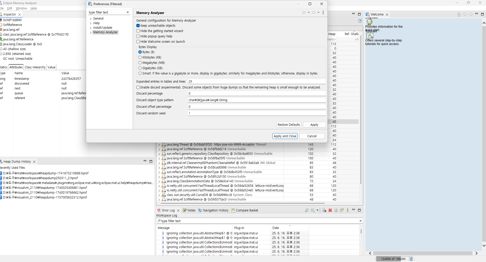
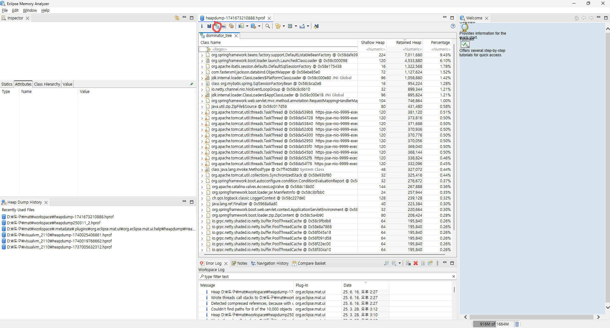
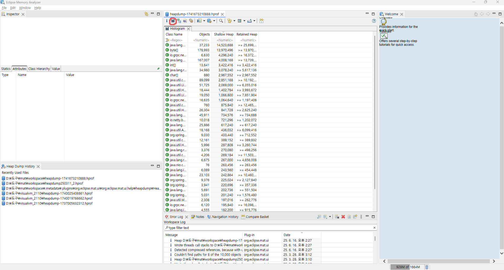
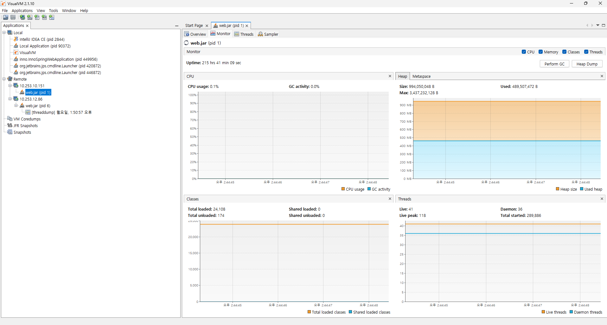

## Java Heap 분석의 목적

- 메모리 누수 여부를 확인하기 위함이다.
- OutOfMemoryError 발생 원인을 분석하기 위함이다.
- GC 성능 문제나 병목 현상을 파악하기 위함이다.
- 객체가 얼마나, 어떻게 사용되고 있는지 추적하기 위함이다.

## Heap Dump란?

힙 덤프는 JVM 힙 메모리 상태를 파일로 저장한 것이다. `.hprof` 확장자를 가지며, 이후 분석 도구로 열 수 있다.

명령어 : jmap -dump:format=b,file=heapdump.hprof {pid}

out of memory exception 발생시 자동 덤프: jar 파일 실행시 -XX:+HeapDumpOnOutOfMemoryError jvm 옵션을 추가한다.

## Java Heap 메모리 구조

자바 힙은 JVM 내에서 객체들이 생성되고 관리되는 공간이다. 크게 Young Generation, Old Generation, Metaspace 영역으로 나뉜다.

- Young Generation: 새로 생성된 객체들이 저장되는 공간이다. GC가 자주 발생한다.

- Eden: 객체가 처음 생성되는 영역이다.

- Survivor: GC에서 살아남은 객체들이 일시적으로 저장되는 영역이다.

- Old Generation: Young에서 살아남은 객체가 이 영역으로 이동한다.

- Metaspace: 클래스 메타데이터를 저장하는 영역이다 (JDK8 이후부터 사용된다).

| 힙 영역 | 누수 예제 코드 | 누수 발생 원인 | 분석 포인트 | 관련 클래스/패턴 |
| -- | -- | -- | -- | -- |
| Young Generation | java for (int i = 0; i < 1_000_000; i++) { new byte[1024]; } | 짧은 생명주기 객체 과다 생성으로 GC 빈도 증가 | Young GC 빈도, Eden/Survivor 공간 과포화, 객체 생존률 | 반복 루프 내 객체 생성, 임시 컬렉션 |
| Old Generation | java static List<byte[]> cache = new ArrayList<>(); public void leak() { cache.add(new byte[1024 * 1024]); } | static 컬렉션에 객체 지속 보관으로 GC 대상 제외 | Retained Heap 큰 객체, GC Root 경로 추적 | HashMap, List, static 필드 |
| Old Generation | java Map<Key, Value> map = new HashMap<>(); Key key = new Key(); map.put(key, value); key = null; | key 객체가 GC되지 않음 (key는 GC되지만 entry는 남음) | WeakHashMap이 아닌 HashMap 사용 여부 확인 | HashMap 누수 패턴 |
| Metaspace | (Tomcat에서 WAR 재배포 반복 시) | 클래스 로더가 언로드되지 않고 계속 적재됨 | ClassLoader 인스턴스 수, unload되지 않은 클래스 | Spring, JSP, Tomcat 클래스 로더 |
| Metaspace | ClassLoader cl = new URLClassLoader(...); Class<?> cls = cl.loadClass("MyClass"); | 사용자 정의 ClassLoader가 참조 유지됨 | heap dump에서 ClassLoader → 클래스 참조 확인 | 동적 로딩, 리플렉션 기반 프레임워크 |

### 설명 보충

1. Young Generation
    - 문제: GC는 자주 발생하지만, 힙 사용량이 줄지 않음
    - 원인: Eden 영역에서 계속 새로운 객체가 생성됨
    - 해결: 객체 생명주기 분석 → 재사용 가능 객체는 풀링하거나 캐시로 전환

2. Old Generation

    - 문제: Full GC가 자주 발생하거나, GC 후에도 메모리 회수가 안 됨
    - 원인: 장기 생존 객체가 계속 남아 있음 (static, 캐시, 대형 컬렉션)
    - 해결: Dominator Tree에서 Retained Heap 큰 객체 확인, static 필드 추적

3. Metaspace

    - 문제: 재배포하거나 앱을 여러 번 실행할수록 메모리 점유가 증가 - 보통 tomcat에 war 파일 배포시 해당되는 내용이고, spring boot는 해당 x
    - 원인: ClassLoader가 해제되지 않아서 메타데이터가 남아 있음
    - 해결: ClassLoader 인스턴스 확인, unloadable class 추적

## Heap 분석 도구

- Eclipse MAT: 가장 널리 사용되는 오픈소스 분석 도구이다.
- VisualVM: 실시간 모니터링과 힙 분석이 가능한 도구이다.
- JMC(Java Mission Control): JFR(Java Flight Recorder)을 기반으로 실시간 분석이 가능하다.
- JProfiler, YourKit: 상용 도구이며 정밀 분석 기능이 강력하다.

# 도구를 활용한 Heap 분석 방법

## 정적 분석(MAT 사용)

#### 0. MAT 다운로드 및 초기 설정

운영체제에 맞게 다운로드(jre 필요)
```
https://eclipse.dev/mat/download/
```

MAT는 기본 설정이 unreachable objects는 제외하므로 기본값으로 분석시 실제 dump 사이즈랑 report 결과가 많이 다를 수 있다. 따라서 Window - Preferences - Memory Analyzer 의 Keep unreachable objects를 체크해준다.



###### unreachable objects 부가 설명

- 가비지 컬렉션(GC)에 의해 더 이상 참조되지 않으며, 따라서 다음 GC 사이클에서 제거될 객체들이다

#### 1. 힙 덤프 파일 준비하기

힙 덤프 생성 방법
```
jmap -dump:format=b,file=heapdump.hprof <PID>
```

또는 JVM 옵션으로 자동 생성
```
-XX:+HeapDumpOnOutOfMemoryError
```

`.hprof` 파일 크기가 수백 MB ~ 수 GB일 수 있으므로 분석 전 충분한 메모리 확보 필요

#### 2. MAT로 힙 덤프 열기

- Eclipse MAT 실행
- `File > Open Heap Dump` 클릭
- `.hprof` 파일 선택
- 자동 인덱싱 수행 (처음 열 때만 다소 시간 소요됨)

#### 3. Leak Suspects Report 보기 (자동 분석)

- 힙 덤프 파일을 열면 Leak Suspects Report 실행 여부를 묻는다
- 실행하면 누수 의심 객체에 대한 자동 분석 리포트가 생성된다

###### 포함 내용

- 가장 많은 메모리를 차지하는 객체 그래프
- GC Root로부터의 참조 경로
- 객체 개수와 총 메모리 사용량

#### 4. Dominator Tree 분석
`Histogram > Dominator Tree` 메뉴 또는 `Component Report`를 통해 진입



###### 핵심 개념

- Retained Heap: 해당 객체가 제거될 경우 함께 수거될 메모리 크기
- Dominator: 객체 참조 그래프에서 지배적인 객체(의존성 중심)

###### 사용법

- Retained Heap이 큰 순으로 정렬
- GC Root를 통해 직접 참조 중인 객체인지 확인
- `right click > Path to GC Roots > exclude weak references` 로 참조 경로 추적


#### 5. 클래스별 인스턴스 수, 크기 분석 (Histogram)



- Histogram 뷰를 열어 클래스별 인스턴스 수/합계 메모리 확인
- 인스턴스 수가 비정상적으로 많은 클래스는 누수 가능성 있음
- Group by Class Loader 기능으로 클래스 로딩 관련 누수 추적 가능

#### 6. GC Root 경로 분석

- 특정 객체를 선택하고 → `Path to GC Roots` 실행
- GC에 수거되지 않는 이유를 역추적 가능
- static 필드, thread local, listener 등록 등 불필요한 참조 확인

# 실시간 모니터링(Visual VM)

## VisualVM 설치
- 공식 사이트: https://visualvm.github.io/
- `.zip` 또는 `.exe` 다운로드 후 설치
- jre 필요

## 실행 대상 애플리케이션 설정

#### 로컬 프로세스 모니터링
- 별도의 설정 없이 JVM에서 실행 중인 애플리케이션이 자동 인식됨

#### 원격 모니터링 (JMX 포트 설정 필요)
JVM 실행 시 아래와 같은 옵션을 추가

```java
-Dcom.sun.management.jmxremote
-Dcom.sun.management.jmxremote.port=9010
-Dcom.sun.management.jmxremote.ssl=false
-Dcom.sun.management.jmxremote.authenticate=false
-Djava.rmi.server.hostname=서버IP
```

방화벽 등에서 9010 포트 개방 필요

#### VisualVM에서 연결

- VisualVM 실행 후 왼쪽 패널에서
    - `Local` > 실행 중인 Java 프로세스 선택
    - `Remote` > `Add Remote Host` > IP와 포트 추가

#### 모니터링 가능한 항목

| 항목 | 설명 |
| -- | -- |
| Overview | JVM 정보, PID, 메모리 구성 등 |
| Monitor | CPU 사용량, Heap, GC, Thread 실시간 그래프 |
| Threads | 실행 중인 스레드 목록, 상태 |
| Sampler | CPU/메모리 사용량 높은 메서드 샘플링 |
| Profiler | 정확한 호출 분석 (성능 오버헤드 있음) |
| Heap Dump | 힙 덤프 생성 및 객체 구조 분석 가능 |

#### 모니터링 화면



## 기타 유용 기능

- GC 수동 실행: Monitor 탭 → Perform GC 클릭
- Heap Dump 저장: .hprof 파일 저장 후 MAT 등으로 분석
- CPU Hotspot 분석: 가장 많은 연산을 수행하는 메서드 식별

## Spring Boot 예제 (JMX 설정)

```java
java \
  -Dcom.sun.management.jmxremote \
  -Dcom.sun.management.jmxremote.port=9010 \
  -Dcom.sun.management.jmxremote.ssl=false \
  -Dcom.sun.management.jmxremote.authenticate=false \
  -Djava.rmi.server.hostname=192.168.0.100 \
  -jar my-spring-app.jar
```

## 보안 참고

- 운영 환경에서는 반드시 아래 항목 설정 권장(사용안하는것을 권장):
    - JMX 인증 (jmxremote.password, jmxremote.access)
    - SSL 적용
    - 방화벽 또는 SSH 터널링 사용