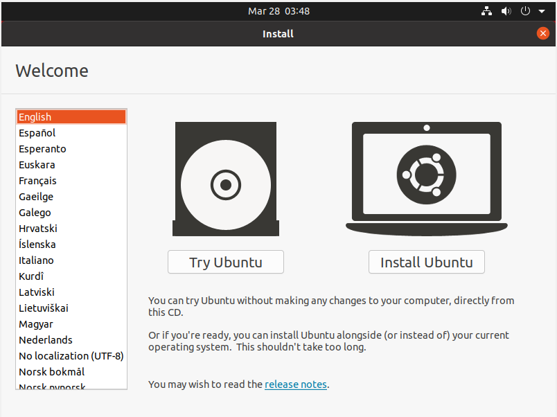
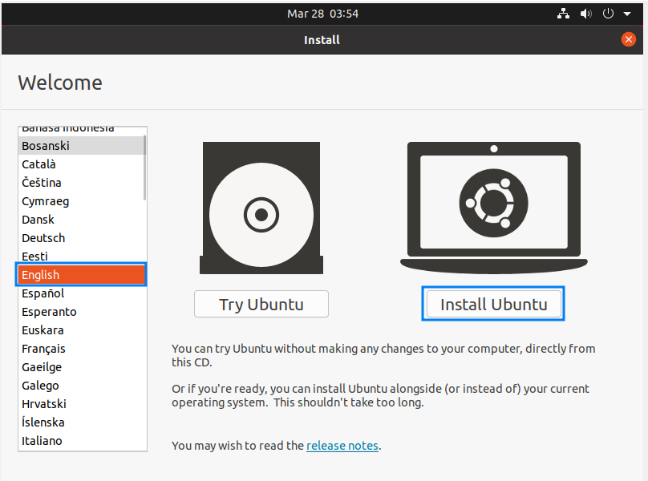
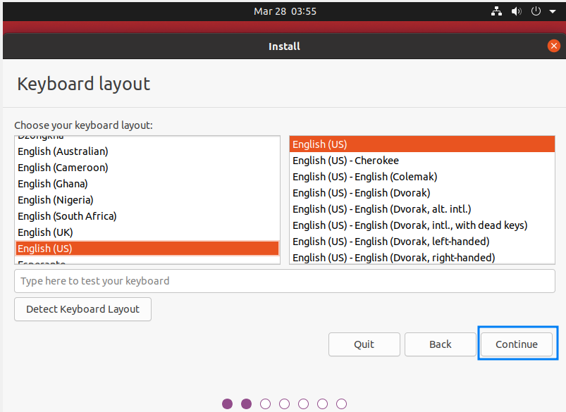

# Ingress 구성


---

# OS 설치

1. Ubuntu 22.04 LTS 버전을 설치
2. OS USB 부팅



3. `ctrl + alt + t` 터미널 진입 후 gparted 실행


4. Gparted 입력 후 빨간색 네모박스의 디스크를 각각 열어서 파티션들을 Delete해서 초기화 한다.
- 우분투는 설치시 disk 초기화가 안되기떄문에 별도 프로그램(gparted)을 실행해서 파티션 초기화 작업을 한다.
- 파란박스에서 장치를 선택해서 각각 파티션을 모두 삭제한다.
- 마지막으로 보라색 박스의 적용을 해준다.
- usb 부팅인경우 usb도 함께 나온다. 삭제하지 않도록 주의한다.


5. English를 선택 후, Install Ubuntu를 선택



6. continue



7. 아래 파란 박스로 체크 후 Continue
인터넷 사용환경이 설정되지 않으면 Download updates 부분은 비활성화 된다. (상관없음)


8. somethime else 선택 후 continue


9. 아래와 같이 파티션을 설정한다.

| 파티션 | 크기 | 비고 |
| -- | -- | -- |
| EFI 파티션 (EFI partition) | 500MB ~ 1GB | EFI를 사용할 경우 필요 |
| 스왑 파티션 | X | 쿠버네티스 노드에서 프로세스의 성능에 부정적인 영향을 미칠 수 있고, 시스템의 예기치 않은 동작이 발생할 수 있음 |
| 루트 파티션 (Root partition) | 100GB 이상 | 운영 체제 및 시스템 로그, Windows의 C 드라이브 |
| 홈 파티션 (Home partition) | 나머지 디스크 공간 | 쿠버네티스 롱혼의 default 경로가 /var/lib/longhorn 인데, 이것을 home으로 변경할 필요가 있다. 따라서 home partition은 필수로 만들어준다. |


10. 계정정보를 작성 후 continue

---

# 네트워크 설정 가이드

1. 우측 상단 아이콘 클릭 후 Ethernet > Wired Setting을 클릭합니다.


2. 연결된 유선 랜의 우측 설정 아이콘을 클릭합니다.


3. IP 설정을 위해 IPv4 탭에서 자동구성이 아닌 수동설정을 위해 Manual을 체크합니다.


4. 주소에 할당 받은 내부 ip 주소 / 서브넷마스크 / 게이트웨이 주소 그리고 DNS 주소를 작성 후 적용합니다.


5. `hostname -I` 명령어를 통해 주소가 정상적으로 설정되었는지를 확인합니다.


---

# 방화벽 설정

추후 NIC 2개 이상 서버 일 때 확인 필요

1. NIC별로 방화벽을 구성한다.

2. 방화벽 ufw 설치

```
sudo apt-get update
sudo apt-get install ufw
```

3. 모든 port 차단

```
sudo ufw default deny
```

4. Eth0 내부망이라고 했을때 22, 17000 open

```
sudo ufw allow in on eth0 to any port 22 proto tcp
sudo ufw allow in on eth0 to any port 17000 proto tcp
```

5. Eth1 외부망이라고 했을때 80 port open

```
sudo ufw allow in on eth1 to any port 80 proto tcp
```

6. outbound 허용

```
sudo ufw allow out to any
```

7. 방화벽 활성화

```
sudo ufw --force enable
```

8. 확인방법

```
sudo ufw status verbose
```

---

# 사용자 인스턴스 개수 변경

## 개요

특정 인스턴스가 너무 많으면 Too Many open files 라는 문구와 함께 컨테이너가 죽는 현상이 있다. 기본값은 128개이기 때문에 값을 더 크게 작성한다.

## 설정 방법

설정값을 적용하기 위해서는 아래의 순서대로 실행한다.

- sysctl.conf 파일을 오픈한다.

```
vi /etc/sysctl.conf
```

- 제일 마지막 부분에 아래 내용을 작성한다.

```
fs.inotify.max_user_instances=1024
```

- 아래 명령으로 현재 시스템에 적용한다.

```
sudo sysctl -p
```

## 현재값 확인 방법

```
sysctl -a | grep fs.inotify.max_user_
```

