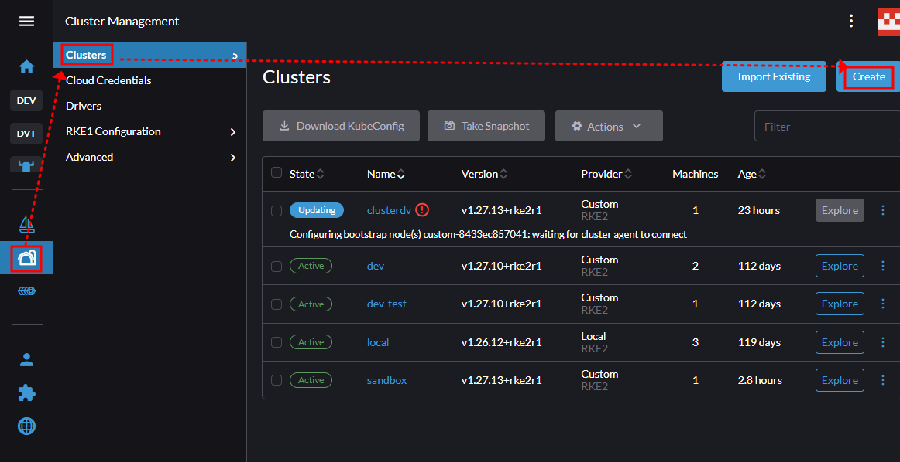
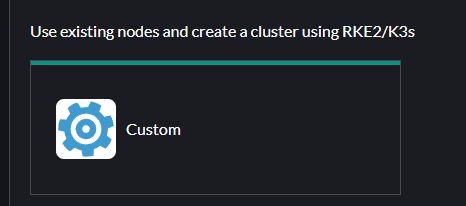
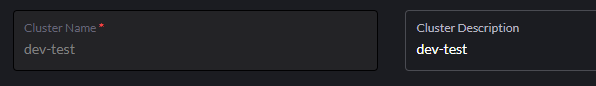
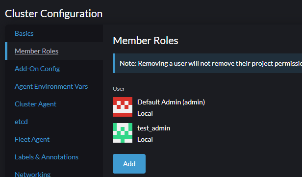
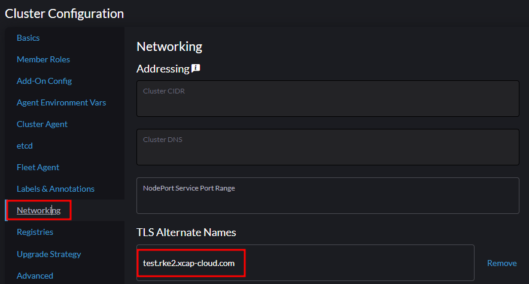
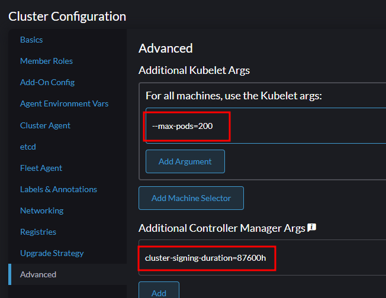
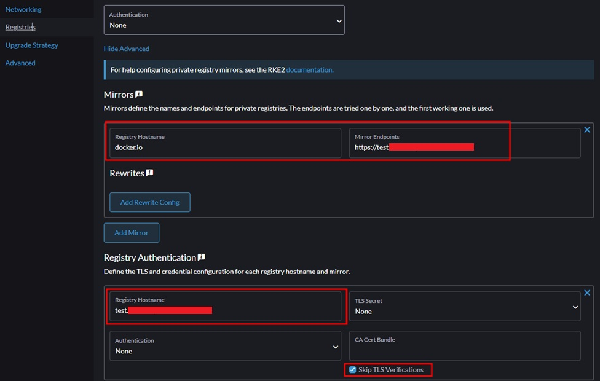
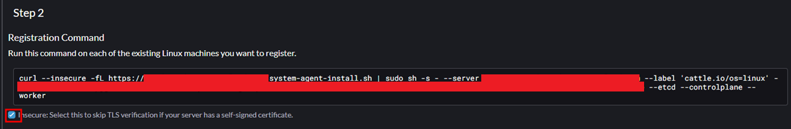

# Rancher Manager Server

## Ubuntu Common install

- sudo passwd 설정
```
sudo passwd root
```

- root로 로그인
설정한 비밀번호로 로그인
```
su
```

- 초기 설정 필요한 util 설치(yq, curl, net-tools, apt upgrade)
```
sudo wget -qO /usr/local/bin/yq https://github.com/mikefarah/yq/releases/latest/download/yq_linux_amd64 && sudo chmod a+x /usr/local/bin/yq && sudo apt update && apt install -y curl net-tools && apt upgrade -y
```

---

# Create Cluster

1. Rancher Manager UI에 접속하여 admin계정으로 접속하여 Cluster를 만들어준다.

2. Cluster Management에서 Create 버튼을 클릭한다.



3. cluster 목록에서 custom을 선택한다.



4. 각 항목에 맞게 작성한다.
- Cluster Name 작성


- Member Roles 추가


- Networking 에서 TLS Alternative Names에 해당 도메인 및 IP 주소들을 작성


- 최대 pods 개수 및 인증서 최소 시간 수정
--max-pods=200
cluster-signing-duration=87600h


- Registries 추가
skip TLS Verifications 체크


5. 생성하면 만들어진 cli 명령어를 각 서버에서 실행한다.



6. kubectl 활용하기 위해 kubeconfig 처리

```
mkdir -p ~/.kube/ && cp /etc/rancher/rke2/rke2.yaml ~/.kube/config
```