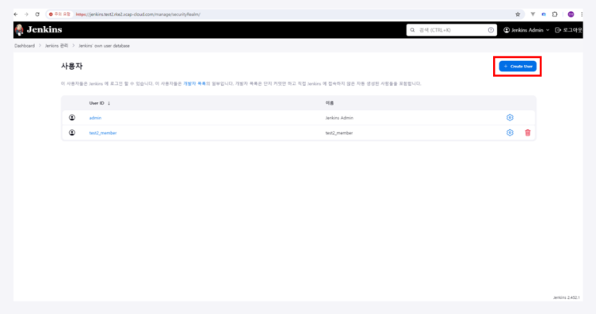

# Jenkins 설정

1. 관리자 접속정보 확인

해당 명령어를 통해 관리자 접속 정보를 알아냅니다.


```
kubectl exec --namespace jenkins -it svc/jenkins -c jenkins -- /bin/cat/run/secrets/additional/chart-admin-password && echo
```

2. 관리자 로그인

사용자 이름은 admin / 비밀번호는 위에서 알아낸 정보를 이용하여 관리자 계정으로 로그인을 진행합니다.


3. 계정 추가

- Jenkins 관리 탭 > Users 메뉴에 들어가 일반 사용자를 추가합니다.


- `Create User ` 버튼을 통해서 일반 사용자를 추가합니다.




4. Credentials 추가

Credentials는 젠킨스 파이프라인을 통해 git에서 code를 clone 할 때 권한을 인증해주는 역할을 담당합니다.

- Jenkins 관리 탭 > Credentials 메뉴를 클릭합니다.


- (global) 우측 화살표를 클릭 후 `Add Credentials` 버튼을 톨해 새로운 인증정보를 추가합니다.


- Jenkins에서 Git에 접근할 떄 사용할 인증정보를 추가합니다. 
- Kind는 `Username with password`입니다.


- 추가로 Gitlab에 접근할 때 git에서 인증을 진행할 token 정보를 생성합니다.
- Kind는 `GitLab API token`입니다.


- token 값은 깃랩에서 본인의 프로필을 클릭 후 `Access Token` 탭 클릭
- token의 이름과 적절한 권한을 부여하면 생성할 수 있습니다.


- 생성이 완료된 access token을 위의 token 값으로 입력합니다.


## Plugin 추가

- Jenkins 탭 > Plugin 메뉴를 클릭합니다.


- Available plugins 탭에서 `pipeline-stage-view` 검색 후 `Pipeline Stage View Plugin` 우측의 `install` 버튼을 통해 설치를 진행합니다.


- Pipeline stage view 란?

추후 젠킨스에서 파이프라인 구성 시 각 상태의 진행상태 및 성공 / 실패 여부를 확인하기 위해 설치


## Time Zone 변경

- 위에서 추가한 일반 사용자로 로그인 이후 설정 탭 > 스크롤을 제일 하단까지 내립니다.


- Time Zone 설정을 `Asia/Seoul`로 변경합니다.


* Time zone 변경 이유

추후 스케쥴러 등 시간 설정 시 내가 원하지 않는 시간에 작업이 이루어지는 것을 방지하기 위해서