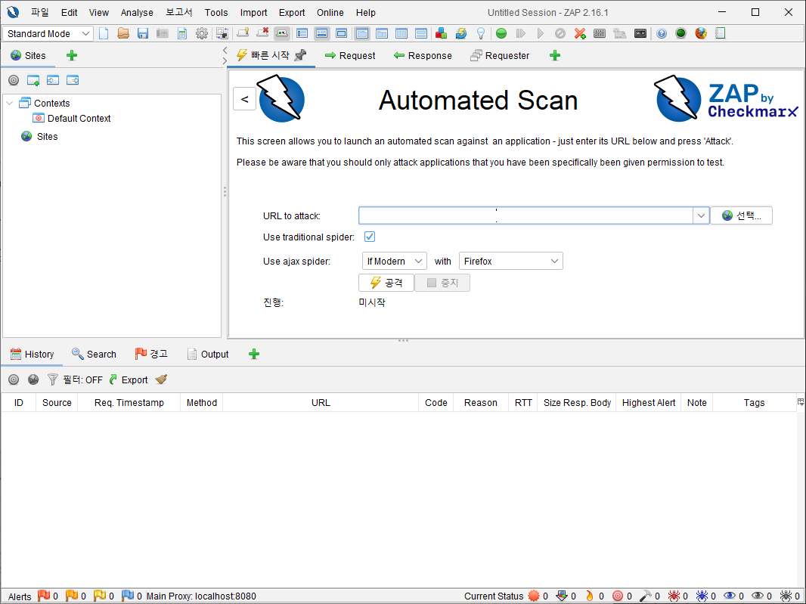
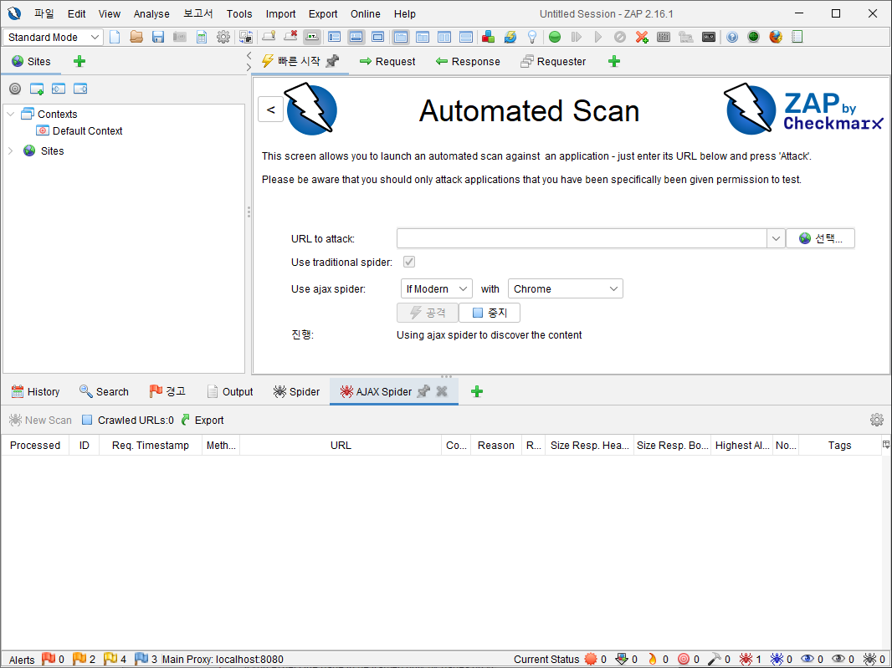
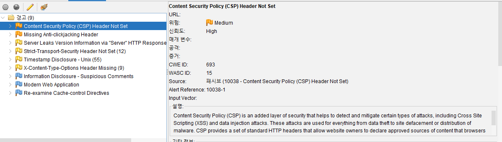
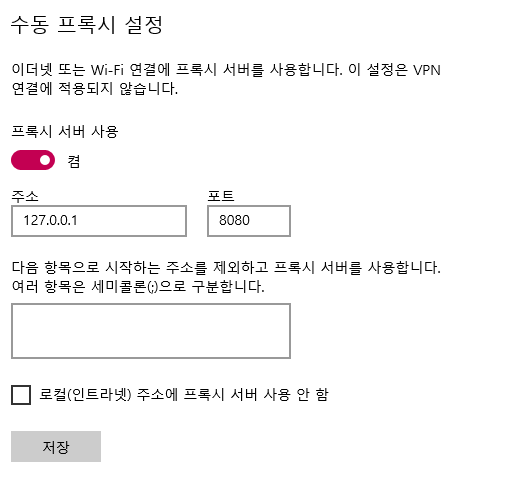
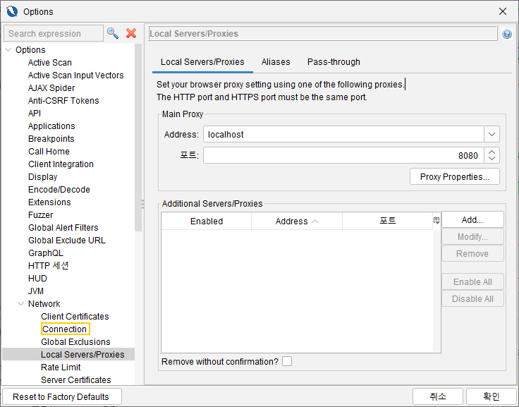
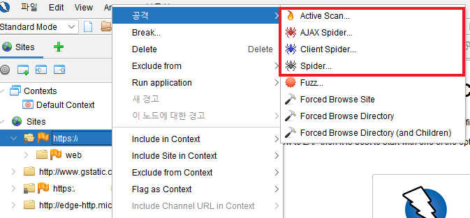
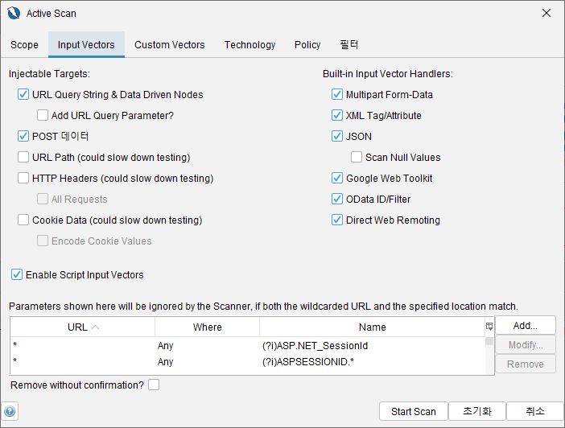
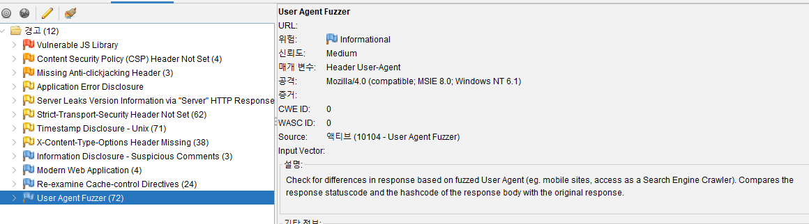

## ZAP이란?

OWASP에서 개발한 무료 오픈소스 웹 애플리케이션 보안 진단 도구이다. DAST (Dynamic Application Security Testing) 방식으로, 실행 중인 웹 애플리케이션에 대해 공격을 시뮬레이션한다. 보안 전문가뿐 아니라 개발자/QA도 쉽게 사용할 수 있는 GUI와 자동화 기능을 제공한다.

## Automated Scan으로 검사

1. 주소 입력

2. 공격하기

3. 취약점 결과

## 수동 스캔으로 세밀한 검사

1. 프록시 설정

    

    

2. 사이트 취약점 검사

    

    

    - Active Scan: 알려진 취약점들에 대해서 실제로 공격을 수행하는 기능
    - Spider: 해당 URL을 크롤링하여 어떤 콘텐츠와 기능들이 있는지 스캔하는 기능

3. 검사 결과

    